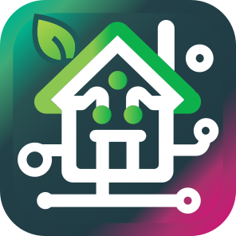

<p align="center">
    
    
</p>

<h1 align="center">Matterbridge Xiaomi MIoT Plugin</h1>

<p align="center">
    <a href="https://www.npmjs.com/package/matterbridge">
        
    </a>
    <a href="https://www.npmjs.com/package/miio-api">
        
    </a>
    <a href="#supported-devices">
        
    </a>
    <a href="LICENSE">
        
    </a>
</p>

---

**Matterbridge Xiaomi MIoT Plugin** is a dynamic platform plugin for
[Matterbridge](https://www.npmjs.com/package/matterbridge) that exposes **Xiaomi fans, air purifiers, lamps and Dreame
robot vacuums** as native Matter devices in Apple Home and other Matter controllers.

Everything runs **locally over the miIO/MIoT protocol** — the plugin talks to each device directly on your LAN using its
IP and token. No Xiaomi cloud session, no cloud tokens to refresh, and it keeps working when your internet connection
does not.

It is the Matter counterpart of [`homebridge-miot`](https://github.com/merdok/homebridge-miot): the per-device
`*Control` flags are named the same, so an existing Homebridge configuration can be copied over almost verbatim.

## Features

- **Fans** — on/off, a continuous 1–100 % speed, horizontal oscillation and the natural wind mode
- **Air purifiers** — on/off, `Auto` plus three manual fan levels, a speed slider driving the 12-step favorite level,
  and the remaining HEPA filter life with warning and critical indications
- **Air quality** — PM2.5, PM10, temperature and humidity as a Matter air quality sensor, with the air quality level
  derived from PM2.5
- **Lamps** — on/off, brightness and color temperature
- **Robot vacuums** — start, stop, pause, resume, return to dock, suction and mop levels as clean modes, battery with
  its charging state, and rooms as Matter service areas
- **Optional extras** — beeper, display, child lock, ionizer, operating modes and light scenes, each behind its own
  configuration flag
- Devices that are offline at startup are still exposed and picked up as soon as they answer

Everything above works locally. There is no cloud fallback.

## Supported devices

| Device                          | Model                                                | Exposed as                                                      |     Verified      |
| ------------------------------- | ---------------------------------------------------- | --------------------------------------------------------------- | :---------------: |
| Mi Smart Fan 2                  | `dmaker.fan.p18`                                     | Fan                                                             | ✅ &nbsp;@lirik44 |
| Xiaomi Smart Air Purifier 4 Pro | `zhimi.airp.vb4`                                     | Air purifier + air quality sensor (PM2.5, PM10, temp, humidity) | ✅ &nbsp;@lirik44 |
| Xiaomi Smart Air Purifier 4     | `zhimi.airp.mb5`                                     | Air purifier + air quality sensor (PM2.5, temp, humidity)       | ✅ &nbsp;@lirik44 |
| Mi LED Desk Lamp 1S             | `yeelink.light.lamp4`                                | Color temperature light (2600–5000 K)                           | ✅ &nbsp;@lirik44 |
| Dreame F9                       | `dreame.vacuum.p2008`                                | Robotic vacuum cleaner                                          | ✅ &nbsp;@lirik44 |
| Dreame D9                       | `dreame.vacuum.p2009`                                | Robotic vacuum cleaner                                          |        ❔         |
| Dreame Z10 Pro                  | `dreame.vacuum.p2028`                                | Robotic vacuum cleaner                                          |        ❔         |
| Dreame Mop 2 Pro+ / Ultra / 2   | `dreame.vacuum.p2041o` &nbsp;`p2150a` &nbsp;`p2150o` | Robotic vacuum cleaner                                          |        ❔         |

Verified means read _and_ write were exercised against the real device on firmware `2.1.3` (fan), `2.2.7` (purifiers),
`2.1.7_0020` (lamp) and `4.1.8_1107` (Dreame F9), with Matterbridge 3.10.5 on Node 22.

An unlisted `dreame.vacuum.*` model falls back to the F9 mapping, since Dreame publishes near-identical specifications
across its vacuum line; the plugin logs that it is guessing.

> ⚠️ The Dreame 1C (`dreame.vacuum.mc1808`) uses a **different** MIoT map and is not supported yet.

Adding a model is a single file: look its specification up on [home.miot-spec.com](https://home.miot-spec.com/), write
the `siid`/`piid` mapping into `src/specs/` and register it in `src/specs/index.ts`. Nothing else needs to change.

## Installation

This plugin leverages the Matterbridge ecosystem, so you can install it like any other Matterbridge plugin.

> ℹ️ This is not a Homebridge plugin. You need Matterbridge.

### Prerequisites

You need [Matterbridge](https://github.com/Luligu/matterbridge) installed — see their
[installation guide](https://github.com/Luligu/matterbridge?tab=readme-ov-file#prerequisites).

You also need the **IP address and token** of every device. The
[Xiaomi Cloud Tokens Extractor](https://github.com/PiotrMachowski/Xiaomi-cloud-tokens-extractor) is the easiest way to
get them; it also prints the device id and the model, which are the other two fields worth copying into the
configuration.

> ⚠️ The device must be paired in the **Xiaomi Home** app — tokens cannot be extracted for devices that live only in a
> vendor app such as Dreamehome.
>
> Reconfiguring a device's Wi-Fi generates a new token, and you will need to update the plugin configuration.

Give every device a static lease on your router: the plugin addresses them by IP.

### Install

    npm install -g matterbridge-xiaomi-miot --omit=dev
    matterbridge --add matterbridge-xiaomi-miot

### Configuration

Add your devices to the `devices` array, either through the Matterbridge UI or directly in
`~/.matterbridge/matterbridge-xiaomi-miot.config.json`:

```json
{
  "name": "matterbridge-xiaomi-miot",
  "type": "DynamicPlatform",
  "pollingInterval": 10,
  "devices": [
    {
      "name": "Fan",
      "ip": "192.168.1.46",
      "token": "0123456789abcdef0123456789abcdef",
      "deviceId": "456381061",
      "model": "dmaker.fan.p18"
    },
    {
      "name": "Air Purifier",
      "ip": "192.168.1.147",
      "token": "0123456789abcdef0123456789abcdef",
      "deviceId": "682252461",
      "model": "zhimi.airp.vb4"
    },
    {
      "name": "Desk Lamp",
      "ip": "192.168.1.152",
      "token": "0123456789abcdef0123456789abcdef",
      "deviceId": "405205485",
      "model": "yeelink.light.lamp4"
    },
    {
      "name": "Vacuum",
      "ip": "192.168.1.60",
      "token": "0123456789abcdef0123456789abcdef",
      "model": "dreame.vacuum.p2008",
      "roomIds": [1, 2, 3],
      "roomNames": ["Laundry", "Bathroom", "Study"]
    }
  ],
  "debug": false,
  "unregisterOnShutdown": false
}
```

#### Per-device options

| Option             | Default    | Effect                                                                                                                 |
| ------------------ | ---------- | ---------------------------------------------------------------------------------------------------------------------- |
| `name`             | –          | Required. The name shown in the controller app.                                                                        |
| `ip`               | –          | Required. Give the device a static lease on your router.                                                               |
| `token`            | –          | Required. 32 hexadecimal characters.                                                                                   |
| `model`            | auto       | The MIoT model. When omitted the device is asked, which requires it to be online at startup.                           |
| `deviceId`         | –          | Used as the Matter serial number. Setting it keeps the device identity stable even when it is offline at startup.      |
| `pollingInterval`  | `10`       | How often the device is polled, in seconds.                                                                            |
| `deviceEnabled`    | `true`     | Set to `false` to skip the device without deleting its configuration.                                                  |
| `sensorsControl`   | `true`     | Air purifier: expose air quality, PM2.5/PM10, temperature and humidity.                                                |
| `separateSensors`  | `true`     | Air purifier: expose the sensors as their own bridged device. Required for Apple Home.                                 |
| `filterControl`    | `true`     | Air purifier: expose the remaining HEPA filter life.                                                                   |
| `speedControl`     | `favorite` | Air purifier: `favorite` maps the speed slider onto the 12-step favorite level, `levels` onto the 3 manual fan levels. |
| `buzzerControl`    | `false`    | Expose the beeper as a switch.                                                                                         |
| `ledControl`       | `false`    | Expose the display / indicator light as a switch.                                                                      |
| `childLockControl` | `false`    | Expose the physical controls lock as a switch.                                                                         |
| `modeControl`      | `false`    | Expose the operating modes as switches (purifier: auto/sleep/favorite/manual, fan: straight/natural wind).             |
| `swingControl`     | `false`    | Fan: expose the oscillation as a separate switch (Apple Home hides it in the accessory settings).                      |
| `ionizerControl`   | `false`    | Air purifier: expose the ionizer as a switch.                                                                          |
| `sceneControl`     | `false`    | Light: expose the built-in scenes as momentary switches.                                                               |
| `roomIds`          | –          | Vacuum: segment ids of the rooms to expose as service areas.                                                           |
| `roomNames`        | –          | Vacuum: room names, in the same order as `roomIds`.                                                                    |
| `debug`            | `false`    | Debug logging for this device only.                                                                                    |

Every enabled `*Control` flag adds one more bridged device, which shows up as its own tile in the controller app. With
all flags off, a device is a single tile — plus the sensor device for a purifier.

### Rooms

Dreame robots do not expose their segment list over MIoT — the map is only available as an opaque blob — so rooms cannot
be discovered automatically. Declare them with `roomIds` and `roomNames` instead.

To find the segment IDs, either check the Xiaomi Home app or use
[`mibridge`](https://www.npmjs.com/package/@mibridge/cli):

    XIAOMI_REGION=<your-region> mibridge rooms <device-id>

    Rooms:
      ID 1    Laundry
      ID 2    Bathroom
      ID 3    Study

> ⚠️ Matter requires every service area to have a unique name. If two rooms share a name (two bathrooms, for example),
> pairing fails with `Areas must have a unique AreaInfo field`. Give them distinct names in `roomNames`.

### Pairing

Restart Matterbridge and pair the bridge in your controller as usual.

    sudo systemctl restart matterbridge

A **robot vacuum is exposed as its own Matter node**, so it gets a **separate QR code** in the Matterbridge UI — scan
that one, not the QR code of the bridge itself. Apple Home and Google Home both refuse to show a bridged RVC, and Apple
Home can become unstable when an RVC shares a bridge with other devices.

If pairing gets stuck on "Connecting", remove the accessory from your controller, then reset the commissioning state and
try again:

    matterbridge -reset matterbridge-xiaomi-miot

## Apple Home notes

Apple Home does not render the child endpoints of a composed device, and it shows only the primary type of a device.
Purifier sensors are therefore exposed as three separate devices — air quality (with PM2.5/PM10), temperature and
humidity — which is what `separateSensors: true` does. Set it to `false` for Google Home or Home Assistant, which prefer
a single composed device.

Two things Apple Home does not offer for Matter devices, no matter what the plugin advertises: the speed is rendered as
a bare number rather than a percentage, and the oscillation lives in the accessory settings instead of on the tile
(`swingControl: true` adds a switch tile as a workaround). A HomeKit bridge such as Homebridge shows both, because
HomeKit has dedicated characteristics for them.

State changes made on the device itself appear after the next poll — Matter has no way for a controller to ask for a
fresh reading, unlike HomeKit. Lower `pollingInterval` to 3 seconds if the default 10 feels sluggish.

Apple Home also has no concept for the sleep and favorite modes of a purifier, so they are reachable through the speed
slider (`speedControl: "favorite"`) or as explicit switches (`modeControl: true`). For the same reason a fan advertises
`Off/Low/Medium/High` **without** `Auto`: these fans have no automatic mode.

## Limitations

- **Devices are polled.** Xiaomi devices do not push state changes over the local protocol, so a change made on the
  device itself shows up within one polling interval.
- **`yeelink.light.lamp4` rejects MIoT calls.** Firmware 2.1.7 answers every `get_properties`/`set_properties` with
  `user ack timeout` (-9999), so the plugin drives the lamp over the legacy Yeelight methods (`get_prop`, `set_power`,
  `set_bright`, `set_ct_abx`). Its built-in scenes are only reachable over MIoT, so `sceneControl` has no effect there.
- **Selecting a room starts a full clean.** Service areas are advertised so the rooms show up in your controller, but
  segment cleaning needs a vendor-specific payload that is not part of the shared MIoT spec. A room request logs a
  warning and cleans everything.
- **Pause maps to `stop_clean`** on models without a dedicated pause action, so the robot halts in place.
- The power-off timer (`off-delay-time`) and the fan's oscillation **angle** have no Matter equivalent and are not
  exposed.

## Known issues

| Issue                                                | Comment                                                          | Workaround                                                       |
| ---------------------------------------------------- | ---------------------------------------------------------------- | ---------------------------------------------------------------- |
| The device name is not carried over to Apple Home.   | This affects all Matterbridge devices.                           | Rename the device in the Home app.                               |
| A vacuum shows without controls on macOS.            | The Home app on macOS occasionally fails to render the RVC tile. | Restart the Home app; controls always work from iPhone and Siri. |
| Non-latin device names are hashed into endpoint ids. | Matterbridge derives storage ids from the name.                  | None needed — the visible name stays exactly as configured.      |

## TODO

- [ ] Segment cleaning for Dreame vacuums (needs the vendor payload for `start_clean` with segment arguments)
- [ ] Automatic room discovery (requires decoding the `map_view` blob)
- [ ] Expose air purifier filter hours and purified volume
- [ ] More models: humidifiers, heaters, further fan and purifier generations

## Development

Matterbridge refuses to load a plugin that lists `matterbridge` in any of its dependency sections, so it is installed
without being saved:

    npm install
    npm run dev:matterbridge   # npm install matterbridge --no-save
    npm run build
    matterbridge -add .

Re-run `npm run dev:matterbridge` after any `npm install`, which prunes unsaved packages.

To _run_ a bridge from this working copy, link the very same installation the bridge itself runs from
(`npm link matterbridge`, or a symlink into the global `node_modules`). Two separate copies of `matterbridge` — one for
the host, one in this folder — make the host reject the plugin with `does not export a valid MatterbridgePlatform`,
because the two copies carry different class identities.

    npm run build          # compile
    npm run lint           # eslint, zero warnings
    npm run format:check   # prettier

## Credits

- [Luligu/matterbridge](https://github.com/Luligu/matterbridge) — the Matter bridge itself
- [merdok/homebridge-miot](https://github.com/merdok/homebridge-miot) — the MIoT property maps this plugin's
  specifications were derived from
- [afharo/matterbridge-xiaomi-roborock](https://github.com/afharo/matterbridge-xiaomi-roborock) — prior art for the Matter RVC mapping
- [russtone/miio-api](https://github.com/russtone/miio-api) — the miIO transport
- [rytilahti/python-miio](https://github.com/rytilahti/python-miio) — reference implementation of the Dreame MIoT mapping

## License

Apache-2.0
